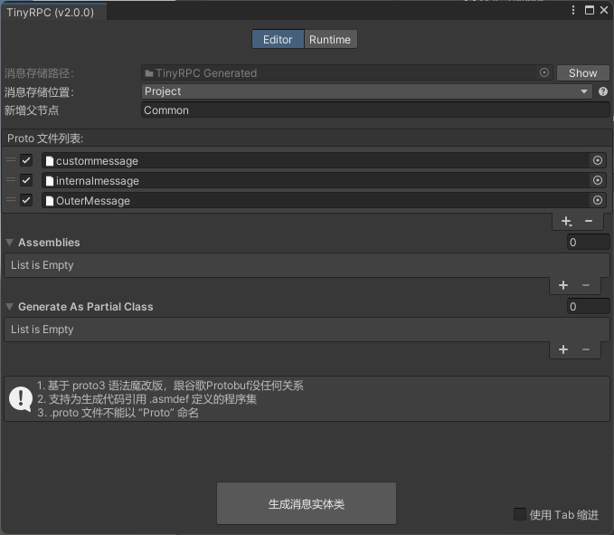
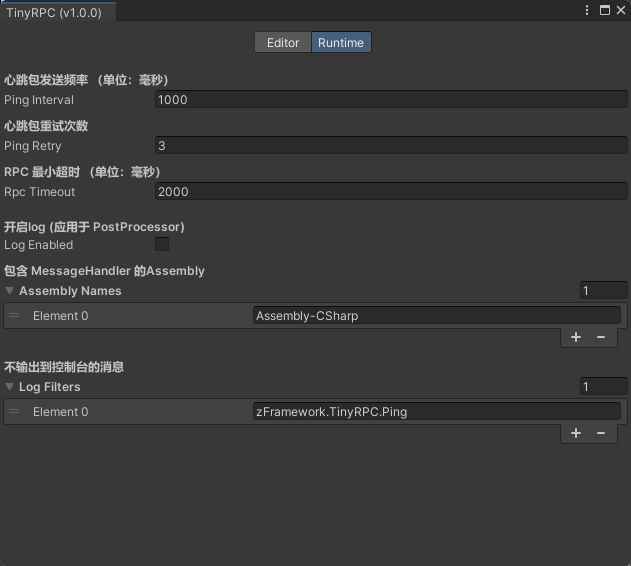
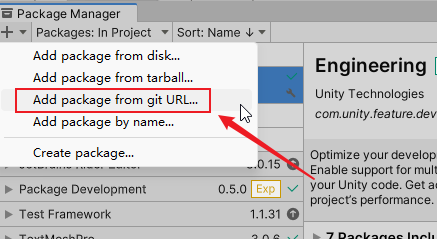
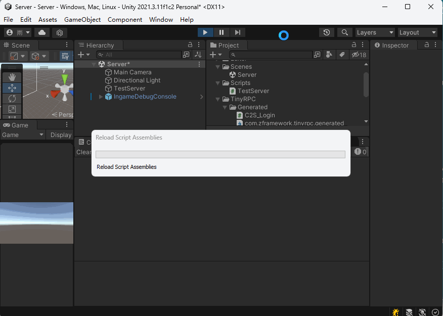
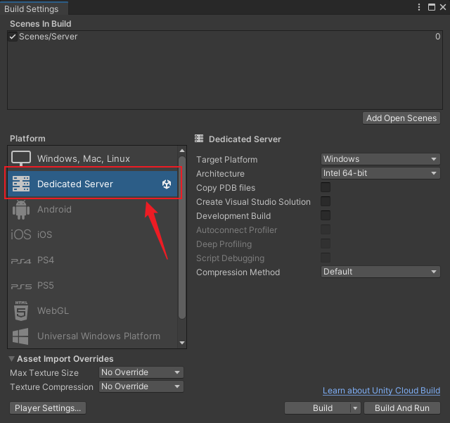

<a id="chinese">[English](#english)</a>
# TinyRPC

TinyRPC 是一个使用 Socket + JsonUtility 的没有第三方依赖的简易 RPC 框架。它的目标是提供一个轻量级、易于使用的 RPC 解决方案。

这个网络框架很多地方学习参考了 [ET](https://github.com/egametang/ET) ，在此表示感谢。

# 特性

* 支持``async await`` 异步逻辑同步写的语法糖，让你的代码更加简洁优雅且易读。

* 支持客户端和服务器互发 RPC 请求。

* 支持常规网络消息的收发

* 支持基于事件的完善的网络通信生命周期管理，断线即刻感知。

* 2 种消息处理的注册方案：监听模式 、Attribute 标注模式
  
# 功能

> 消息的发送

* 使用 ``Send(message)`` 发送普通网络消息

* 使用 ``var response =  await Call(request)`` 发送 RPC 请求并等待响应

> 观察者模式注册的消息处理器

* 使用 ``UnityEngine.Component.AddNetworkSignal<Session,T>()`` 注册一个普通的网络处理器

* 使用 ``UnityEngine.Component.AddNetworkSignal<Session,TRequest,TResponse>()`` 注册一个 RPC 处理器

> 通过反射自动注册消息处理器

* 使用 ``[MessageHandlerProviderAttribute]`` 标记一个消息处理器容器（类型）
* 使用 ``[MessageHandlerAttribute(MessageType.Normal)]`` 标记一个消息处理器
* 使用 ``[MessageHandlerAttribute(MessageType.RPC)]`` 标记一个 RPC 消息处理器

> 消息类一键生成

使用基于 proto3 精简版语法的 .proto 文件，可以一键生成消息类。如果存在多个 .proto 文件则会将消息生成在以 .proto 文件名命名的文件夹中。

支持将生成的消息存在 Assets、Project 同级以及 Packages 文件夹中。他们的优越性在于生成在 Packages 文件夹中不会对用户工程目录有任何侵入性；存在 Project 同级目录将最大化的实现消息文件在多个工程中的复用（本项目架构情形）。




> 运行时参数配置界面

提供了一个可以编辑器下修改、运行时生效的配置界面，可以配置日志过滤器；心跳间隔和重试次数；同时也会自动记录消息处理器所在的程序集信息




## RPC 原理

* TinyRPC 使用 ``System.Threading.Tasks`` 命名空间下的 ``TaskCompletionSource`` 来实现 RPC 的异步等待。

* 使用  ``System.Threading.Tasks`` 命名空间下的 ``CancellationTokenSource.CancelAfter(delay)`` 来实现 RPC 的超时控制。

* 使用对 ``UnityEngine.Component`` 新增扩展方法的方式实现在 MonoBehaviour 实例中像使用本地函数一样注册消息处理器

* 使用  ``System.Reflection`` 命名空间下的 ``MethodInfo `` 配合 `` Delegate.CreateDelegate(typeof(Action<Session, T>), method)`` 实现对 ``MessageHandlerAttribute(MessageType.Normal)`` 标注的常规消息处理器的自动注册

* 使用  ``System.Reflection`` 命名空间下的 ``MethodInfo `` 配合 `` Delegate.CreateDelegate(typeof(Func<Session, TRequest, TResponse, Task>), method)`` 实现对 ``MessageHandlerAttribute(MessageType.RPC)`` 标注的 RPC 消息处理器的自动注册

* 使用 ``MessageWrapper`` 记录消息的类型信息及其 Json 数据来实现通过 ``JsonUtility`` 也能对多继承消息的序列化/反序列化

# 安装

> 通过 git URL 安装

1. 点击 ``Window->Package Manager`` 打开 Package Manager 窗口

2. 将 `https://github.com/Bian-Sh/TinyRPC.git/?path=Common/TinyRPC` 粘贴到 Package Manager 中（大小写敏感）

3. 想要支持从 git URL 安装，需要使用 Unity 2019.3.4f1 或更高版本

4. 在中国使用 git URL 安装的成功率较低，请自行选择其他安装方式。

 


# 快速开始

1. 克隆此仓库到你的本地机器上。

2. 在 Unity 编辑器中分别打开 **Client** 和  **Server** 项目

3. 先运行 **Server** ，此时会自动创建服务器

4. 再运行 **Client** , 点击 Play 后在 Game 窗口可以连接/断开服务器，通过 SendRPC 测试 RPC 会话。

5. 本项目使用 Unity 2021.3.11f2 开发  ，请使用此版本或者更高阶版本                      



6. 你也可以把 TinyRPC 提供的 Server 示例 打包成 Dedicated Server 部署在 Dedicated Server 支持的系统或平台上！




## 登录、消息发送

在 Unity 客户端中，我们使用了以下关键 API：

- `client.ConnectAsync()`: 这个方法用于连接到服务器。
- `client.Send(message)`: 这个方法用于发送一个普通消息。
- `await client.Call<TestRPCResponse>(request)`: 这个方法用于发送一个 RPC 请求并等待响应。

> 登录逻辑

下面是 TinyRPC 连接服务器逻辑 

也模拟了网络不好情况下的登录表现，展示了如何通过 async 异步对登录流程的优雅控制。

```csharp
  private async void StartConnectAsync()
  {
      connect.interactable = false;

      //模拟网络延迟情况下的登录
      //1. 显示登录中...
      var tcs = new CancellationTokenSource();
      _ = TextLoadingEffectAsync(tcs);

      //2. 模拟一个延迟完成的登录效果
      var delay = Task.Delay(3000);
      var task = client.ConnectAsync();
      await Task.WhenAll(delay, task);

      //3. 取消登录中...的显示
      tcs.Cancel();

      //4. 转换 connect 字样为 disconnect
      connect.GetComponentInChildren<Text>().text = "Disconnect";
      connect.interactable = true;
  }
```

 这段逻辑中，我使用 Task.WhenAll + Task.Delay 实现了一个长时间的登录效果，这样文本组件就有足够时间展示 Connect... 动画了，当登录完成，就将文本改为 Disconnect，方便下个回合的交互。

 当然，你还可以对这段逻辑 Try Catch，处理登录失败的情况，这里我就不誊写啦，更多交互细节请运行示例项目体验。

 > RPC 消息发送

下面是 TinyRPC 发送 RPC 并等待回应的逻辑，同样，得益于 RPC 的使用，与服务器的对话再也不需要调用 监听者模式这种割裂的交互方式了（TinyRPC也支持监听模式，毕竟还有常规消息要处理嘛）

```csharp
        public async void SendRPCAsync()
        {
            if (client != null && client.IsConnected)
            {
                var request = new TestRPCRequest();
                request.name = "request from tinyrpc client";
                var response = await client.Call<TestRPCResponse>(request);
            }
        }
```

 这段逻辑中，我先构建了一个请求，并告知服务请求的信息，接着等待服务器返回的数据。

 > 常规消息发送

下面是 Tiny RPC 发送常规消息的逻辑，构建一个 Normal 消息，调用 Send 就好啦。

```csharp
        private void SendNormalMessage()
        {
            if (client != null && client.IsConnected)
            {
                var message = new TestMessage
                {
                    message = "normal message from tinyrpc client",
                    age = 999
                };
                client.Send(message);
            }
        }
```

## 消息处理

在服务器端，我们使用了消息处理器来处理接收到的各类消息：Normal 消息、RPC 消息、Ping 消息。

当然，在客户端也支持通过注册消息处理器来处理 Normal 消息、RPC 消息 （Ping 消息除外）进而实现用户业务逻辑的展开。


> Ping 消息处理器

Ping 消息是一个内置的自响应消息，交由系统自己处理，用户无需关注

```csharp
#region Ping Message Handler 
private static async Task OnPingRecevied(Session session, Ping request, Ping response) 
{ 
    response.Id = request.Id; 
    response.time = ServerTime; 
    await Task.CompletedTask(); 
} 
#endregion 
```

> RPC 消息处理器


1. 下面的示例脚本演示如何通过 ``MessageHandlerProviderAttribute``、 ``MessageHandlerAttribute`` 声明 RPC 消息处理器

```csharp
[MessageHandlerProvider]
class Foo
{
    [MessageHandler(MessageType.RPC)]
    private static async Task RPCMessageHandler(Session session, TestRPCRequest request, TestRPCResponse response)
    {
        Debug.Log($"{nameof(TestServer)}: Receive {session} request {request}");
        await Task.Delay(1000);
        response.name = "response  from  tinyrpc server !";
    }
}
```

这个消息处理器收到 RPC 请求后，间隔了一秒钟，然后向请求端发出响应信息： “response  from  tinyrpc server ”。

2. 下面示例脚本中演示如何使用 ``UnityEngine.Component.AddNetworkSignal<Session,TRequest,TResponse>()`` 注册/注销 RPC 消息处理器

```csharp
using System.Threading.Tasks;
using UnityEngine;
using zFramework.TinyRPC;
using zFramework.TinyRPC.Generated;

public class Foo : MonoBehaviour
{
    private void OnEnable()=>this.AddNetworkSignal<TestRPCRequest, TestRPCResponse>(RPCMessageHandler);

    private void OnDisable()=>this.RemoveNetworkSignal<TestRPCRequest, TestRPCResponse>(RPCMessageHandler);
    
    private static async Task RPCMessageHandler(Session session, TestRPCRequest request, TestRPCResponse response)
    {
        await Task.Delay(500);
        response.name = $"response  from  tinyrpc {(session.IsServerSide ? "SERVER" : "CLIENT")}  !";
    }
}
```

> 普通消息处理器

1. 下面的示例脚本中演示如何使用 ``MessageHandlerProviderAttribute``、 ``MessageHandlerAttribute`` 声明普通消息处理器

```csharp
[MessageHandlerProvider]
class Foo
{
	[MessageHandler(MessageType.Normal)]
	private static void NormalMessageHandler(Session session, TestMessage message)
	{
		Debug.Log($"{nameof(TestServer)}: Receive {session} message {message}");
	}
}
```

这个消息处理器收到普通消息后，直接 log 输出到屏幕。

2. 下面示例脚本中演示如何使用 ``UnityEngine.Component.AddNetworkSignal<Session,T>()`` 注册普通消息处理器

```csharp

using UnityEngine;
using zFramework.TinyRPC;
using zFramework.TinyRPC.Generated;

public class Foo: MonoBehaviour
{
    private void OnEnable()=>this.AddNetworkSignal<TestMessage>(OnTestMessageReceived);

    private void OnDisable()=>this.RemoveNetworkSignal<TestMessage>(OnTestMessageReceived);

    private void OnTestMessageReceived(Session session, TestMessage message)
    {
        Debug.Log($"获取到{(session.IsServerSide ? "客户端" : "服务器")}  {session}  的消息, message = {message}");
    }
}
```


# 框架架构

下面是 TinyRPC 的文件系统树，点击可以看到完整网络架构

<details>
<summary>  点我 ^_^</summary>

```
<root>
|   
+---Editor
|   |   com.zframework.tinyrpc.editor.asmdef
|   |   
|   +---Analyzer
|   |       MessageHandlerPostprocessor.cs
|   |       
|   +---Async
|   |       TaskDriver.cs
|   |       UpmRequestAwaiter.cs
|   |       UpmRequestExtension.cs
|   |       
|   +---CodeGen
|   |       ProtoContentProcessor.cs
|   |       TinyProtoHandler.cs
|   |       
|   +---Data
|   |       ScriptInfo.cs
|   |       ScriptType.cs
|   |       
|   +---GUI
|   |       EditorSettingsLayout.cs
|   |       RuntimeSettingsLayout.cs
|   |       TinyRpcEditorWindow.cs
|   |       
|   \---Settings
|           EditorSettingWatcher.cs
|           ScriptableSingleton.cs
|           TinyRpcEditorSettings.cs
|           
\---Runtime
    |   com.zframework.tinyrpc.runtime.asmdef
    |   
    +---Data
    |       IReusable.cs
    |       MessageType.cs
    |       MessageWrapper.cs
    |       ObjectPool.cs
    |       RpcInfo.cs
    |       SerializeHelper.cs
    |       TinyRpcSettings.cs
    |       
    +---Exception
    |       InvalidSessionException.cs
    |       RpcResponseException.cs
    |       RpcTimeoutException.cs
    |       
    +---Handler
    |   |   
    |   +---Attribute
    |   |       MessageHandlerAttribute.cs
    |   |       MessageHandlerProviderAttribute.cs
    |   |       
    |   +---Base
    |   |       NormalMessageHandler.cs
    |   |       RpcMessageHandler.cs
    |   |       
    |   +---Extension
    |   |       MessageHandlerEx.cs
    |   |       
    |   \---Interface
    |           INormalMessageHandler.cs
    |           IRpcMessageHandler.cs
    |           
    +---Internal
    |       Manager.cs
    |       Session.cs
    |       TinyClient.cs
    |       TinyServer.cs
    |       
    \---Message
        |   
        +---Attribute
        |       ResponseTypeAttribute.cs
        |       
        +---Base
        |       Message.cs
        |       Ping.cs
        |       Request.cs
        |       Response.cs
        |       
        \---Interface
                IMessage.cs
                IRequest.cs
                IResponse.cs
                IRpcMessage.cs
                
```
</details>

## 贡献指南

如果你有任何问题或建议，欢迎提交 issue 或 pull request。

## License

遵循 MIT 开源协议


<a id="english">[ Top ↑ ](#chinese)</a>

# TinyRPC

TinyRPC is a lightweight RPC framework with no third-party dependencies that uses Socket + JsonUtility. Its goal is to provide a lightweight and easy-to-use RPC solution.

Many aspects of this network framework have been inspired by [ET](https://github.com/egametang/ET), and I express my gratitude for that.

## Features

* Supports elegant coding using ``async await`` for asynchronous logic, making your code more concise and readable.

* Supports bidirectional RPC requests between the client and the server.

* Supports the sending and receiving of regular network messages.

* Supports 2 way of registering message handlers: observer pattern, Attribute annotation mode.

## Functionality

> Message Sending

* Use ``Send(message)`` to send regular network messages.

* Use ``var response = await Call(request)`` to send an RPC request and wait for the response.

> Observer pattern-registered message handlers

* Use ``UnityEngine.Component.AddNetworkSignal<Session, T>()`` to register a regular network handler.

* Use ``UnityEngine.Component.AddNetworkSignal<Session, TRequest, TResponse>()`` to register an RPC handler.

> Automatic registration of message handlers through reflection

* Use ``[MessageHandlerProviderAttribute]`` to mark a message handler container (type).
* Use ``[MessageHandlerAttribute(MessageType.Normal)]`` to mark a regular message handler.
* Use ``[MessageHandlerAttribute(MessageType.RPC)]`` to mark an RPC message handler.

> One-click generation of message classes

Use a .proto file with a simplified syntax based on proto3 to generate message classes with a single click. If there are multiple .proto files, messages will be generated in a folder named after the .proto file.

Supports storing generated messages in the Assets, Project's sibling directory, and Packages folders. The advantage of placing them in the Packages folder is that it won't intrude into the user's project directory. Placing them in the Project folder at the same level maximizes the reuse of message files in multiple projects (in the context of this project's architecture).


> Runtime parameter configuration interface

Provides an interface for runtime configuration changes in the editor, allowing you to configure log filters, heartbeat intervals, and retry counts. It will also automatically record the assembly information of the message handlers.


## RPC Principles

* TinyRPC uses ``TaskCompletionSource`` from the ``System.Threading.Tasks`` namespace to implement asynchronous waiting for RPC.

* Uses ``System.Threading.Tasks.CancellationTokenSource.CancelAfter(delay)`` for RPC timeout control.

* Implement the registration of message handlers in a MonoBehaviour instance, similar to using local functions, by extending the ``UnityEngine.Component`` with new methods.

* Automatically register normal message handlers annotated with ``MessageHandlerAttribute(MessageType.Normal)`` by using ``MethodInfo`` from the ``System.Reflection`` namespace in conjunction with ``Delegate.CreateDelegate(typeof(Action<Session, T>), method)``.

* Automatically register RPC message handlers annotated with ``MessageHandlerAttribute(MessageType.RPC)`` by using ``MethodInfo`` from the ``System.Reflection`` namespace in conjunction with ``Delegate.CreateDelegate(typeof(Func<Session, TRequest, TResponse, Task>), method)``.

* Utilize the ``MessageWrapper`` to record type information and JSON data of messages, enabling the serialization/deserialization of multiple-inherited messages through ``JsonUtility``.
 

## Installation

> Install via git URL

1. Click ``Window->Package Manager`` to open the Package Manager window.

2. Paste `https://github.com/Bian-Sh/TinyRPC.git/?path=Common/TinyRPC` into the Package Manager (case-sensitive).

3. To support installation from a git URL, you need to use Unity 2019.3.4f1 or later.

4. The success rate of installing via git URL in China is relatively low. Please choose another installation method if necessary.

 

## Quick Start

1. Clone this repository to your local machine.

2. In the Unity editor, open the **Client** and **Server** projects separately.

3. Run the **Server** first; the server will be automatically created.

4. Then run the **Client**. After clicking Play, you can connect/disconnect from the server in the Game window and test RPC sessions through SendRPC button.

5. This project was developed using Unity 2021.3.11f2. Please use this version or a higher version.


6. You can also package the TinyRPC server example into a Dedicated Server and deploy it on a system or platform that supports Dedicated Servers!


### Login and Message Sending

In the Unity client, we use the following key APIs:

- `client.ConnectAsync()`: This method is used to connect to the server.
- `client.Send(message)`: This method is used to send a regular message.
- `await client.Call<TestRPCResponse>(request)`: This method is used to send an RPC request and wait for the response.

> Login Logic

Here is the TinyRPC server connection logic. It also simulates the login behavior in case of poor network conditions, demonstrating how to elegantly control the login process through async.

```csharp
private async void StartConnectAsync()
{
    connect.interactable = false;

    // Simulate login in case of network delay
    // 1. Display "Logging in..."
    var tcs = new CancellationTokenSource();
    _ = TextLoadingEffectAsync(tcs);

    // 2. Simulate a delayed login completion effect
    var delay = Task.Delay(3000);
    var task = client.ConnectAsync();
    await Task.WhenAll(delay, task);

    // 3. Cancel the display of "Logging in..."
    tcs.Cancel();

    // 4. Change the text from "Connect" to "Disconnect"
    connect.GetComponentInChildren<Text>().text = "Disconnect";
    connect.interactable = true;
}
```

In this logic, I use Task.WhenAll + Task.Delay to simulate a long login effect, giving the text component enough time to display the Connect... animation. When the login is complete, the text is changed to Disconnect, facilitating interaction in the next round.

Of course, you can also try-catch this logic to handle login failures. I won't write that here; run the sample project to experience more interaction details.

> RPC Message Sending

Here is the logic for sending an RPC and waiting for a response in TinyRPC. Thanks to the use of RPC, communication with the server no longer requires using the observer pattern, which can be a fragmented interaction method (TinyRPC also supports observer mode, as there are regular messages to handle).

```csharp
public async void SendRPCAsync()
{
    if (client != null && client.IsConnected)
    {
        var request = new TestRPCRequest();
        request.name = "request from tinyrpc client";
        var response = await client.Call<TestRPCResponse>(request);
    }
}
```

In this logic, I first build a request, inform the server about the request information, then wait for the server's response data.

> Sending Regular Messages

Here is the logic for sending regular messages in TinyRPC. Simply build a Normal message and call Send.

```csharp
private void SendNormalMessage()
{
    if (client != null && client.IsConnected)
    {
        var message = new TestMessage
        {
            message = "normal message from tinyrpc client",
            age = 999
        };
        client.Send(message);
    }
}
```

### Message Handling

On the server side, we use message handlers to process various messages received, including Normal messages, RPC messages, and Ping messages.

Of course, on the client side, you can also handle Normal and RPC messages through registered message handlers (except for Ping messages). This allows you to handle business logic after receiving network messages.

> Ping Message Handler

The Ping message is a built-in self-response message handled by the system, so users don't need to care any about it.

```csharp
#region Ping Message Handler 
private static async Task OnPingRecevied(Session session, Ping request, Ping response) 
{ 
    response.Id = request.Id; 
    response.time = ServerTime; 
    await Task.CompletedTask(); 
} 
#endregion 
```

> RPC Message Handler

1. In the following example script, we use ``MessageHandlerProviderAttribute`` and ``MessageHandlerAttribute`` to declare an RPC message handler.

```csharp
[MessageHandlerProvider]
class Foo
{
    [MessageHandler(MessageType.RPC)]
    private static async Task RPCMessageHandler(Session session, TestRPCRequest request, TestRPCResponse response)
    {
        Debug.Log($"{nameof(TestServer)}: Receive {session} request {request}");
        await Task.Delay(1000);
        response.name = "response from tinyrpc server!";
    }
}
```

This message handler, upon receiving an RPC request, waits for one second and then sends a response to the requesting party: "response from tinyrpc server!".

2. In the example script below, we demonstrate using ``UnityEngine.Component.AddNetworkSignal<Session, TRequest, TResponse>()`` to register an RPC message handler.

```csharp
using System.Threading.Tasks;
using UnityEngine;
using zFramework.TinyRPC;
using zFramework.TinyRPC.Generated;

public class Foo : MonoBehaviour
{
    private void OnEnable()=>this.AddNetworkSignal<TestRPCRequest, TestRPCResponse>(RPCMessageHandler);

    private void OnDisable()=>this.RemoveNetworkSignal<TestRPCRequest, TestRPCResponse>(RPCMessageHandler);
    
    private static async Task RPCMessageHandler(Session session, TestRPCRequest request, TestRPCResponse response)
    {
        await Task.Delay(500);
        response.name = $"response from tinyrpc {(session.IsServerSide ? "SERVER" : "CLIENT")}!";
    }
}
```

> Normal Message Handler

1. In the example script below, we use ``MessageHandlerProviderAttribute`` and ``MessageHandlerAttribute`` to declare a normal message handler.

```csharp
[MessageHandlerProvider]
class Foo
{
    [MessageHandler(MessageType.Normal)]
    private static void NormalMessageHandler(Session session, TestMessage message)
    {
        Debug.Log($"{nameof(TestServer)}: Receive {session} message {message}");
    }
}
```

This message handler, upon receiving a normal message, logs it directly to the screen.

2. In the example script below, we demonstrate using ``UnityEngine.Component.AddNetworkSignal<Session, T>()`` to register a normal message handler.

```csharp
using UnityEngine;
using zFramework.TinyRPC;
using zFramework.TinyRPC.Generated;

public class Foo: MonoBehaviour
{
    private void OnEnable()=>this.AddNetworkSignal<TestMessage>(OnTestMessageReceived);

    private void OnDisable()=>this.RemoveNetworkSignal<TestMessage>(OnTestMessageReceived);

    private void OnTestMessageReceived(Session session, TestMessage message)
    {
        Debug.Log($"Received {(session.IsServerSide ? "client" : "server")} message from {session}, message = {message}");
    }
}
```

## Framework Architecture

Here is the file system tree of TinyRPC. Click to see the complete network architecture.

<details>
<summary>Click me ^_^</summary>

```
<root>
|   
+---Editor
|   |   com.zframework.tinyrpc.editor.asmdef
|   |   
|   +---Analyzer
|   |       MessageHandlerPostprocessor.cs
|   |       
|   +---Async
|   |       TaskDriver.cs
|   |       UpmRequestAwaiter.cs
|   |       UpmRequestExtension.cs
|   |       
|   +---CodeGen
|   |       ProtoContentProcessor.cs
|   |       TinyProtoHandler.cs
|   |       
|   +---Data
|   |       ScriptInfo.cs
|   |       ScriptType.cs
|   |       
|   +---GUI
|   |       EditorSettingsLayout.cs
|   |       RuntimeSettingsLayout.cs
|   |       TinyRpcEditorWindow.cs
|   |       
|   \---Settings
|           EditorSettingWatcher.cs
|           ScriptableSingleton.cs
|           TinyRpcEditorSettings.cs
|           
\---Runtime
    |   com.zframework.tinyrpc.runtime.asmdef
    |   
    +---Data
    |       IReusable.cs
    |       MessageType.cs
    |       MessageWrapper.cs
    |       ObjectPool.cs
    |       RpcInfo.cs
    |       SerializeHelper.cs
    |       TinyRpcSettings.cs
    |       
    +---Exception
    |       InvalidSessionException.cs
    |       RpcResponseException.cs
    |       RpcTimeoutException.cs
    |       
    +---Handler
    |   |   
    |   +---Attribute
    |   |       MessageHandlerAttribute.cs
    |   |       MessageHandlerProviderAttribute.cs
    |   |       
    |   +---Base
    |   |       NormalMessageHandler.cs
    |   |       RpcMessageHandler.cs
    |   |       
    |   +---Extension
    |   |       MessageHandlerEx.cs
    |   |       
    |   \---Interface
    |           INormalMessageHandler.cs
    |           IRpcMessageHandler.cs
    |           
    +---Internal
    |       Manager.cs
    |       Session.cs
    |       TinyClient.cs
    |       TinyServer.cs
    |       
    \---Message
        |   
        +---Attribute
        |       ResponseTypeAttribute.cs
        |       
        +---Base
        |       Message.cs
        |       Ping.cs
        |       Request.cs
        |       Response.cs
        |       
        \---Interface
                IMessage.cs
                IRequest.cs
                IResponse.cs
                IRpcMessage.cs
                
```
</details>

## Contribution Guidelines

If you have any questions or suggestions, feel free to submit an issue or pull request.

## License

This project is licensed under the MIT License.

<a id="chinese">[ Top ↑](#english)</a>
